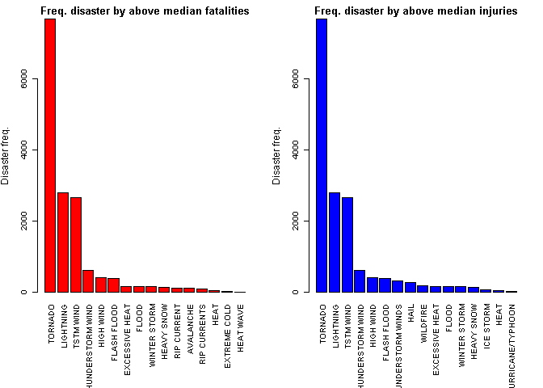
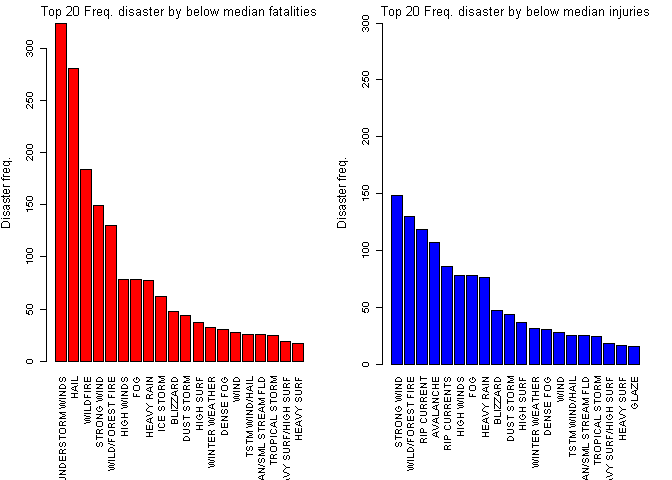
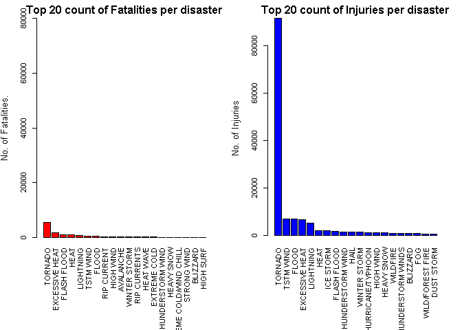
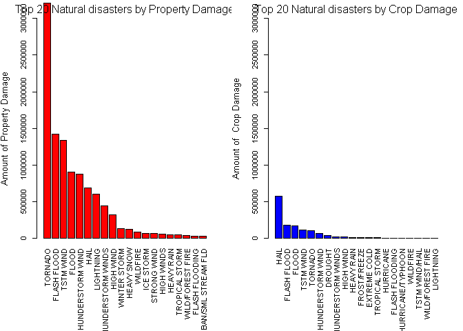
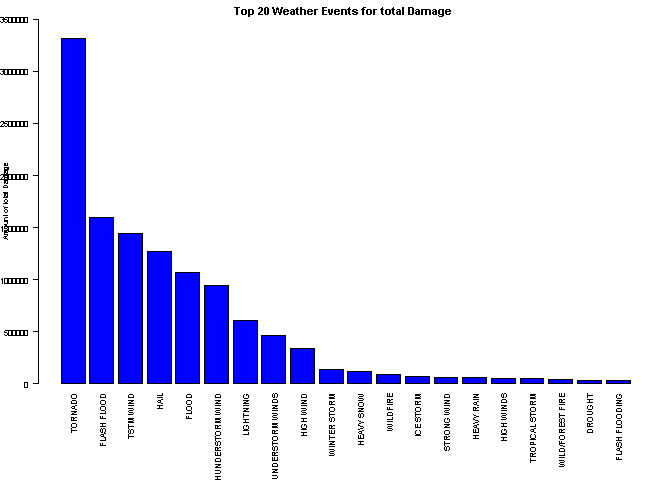

# Synopsis

**Storms and other severe weather events can cause both public health and economic problems for communities and municipalities. Many severe events can result in fatalities, injuries, and property damage, and preventing such outcomes to the extent possible is a key concern. This report tracks characteristics of major natural disasters in the United States, from 1950 to 2011, as well the estimates of any fatalities/injuries, and property/crop damage. Each section attempt to explore the natural weather activities across US with particular focus on people and property damage, reflecting on how each natural disaster affect the mentioned factors. The results show a uniform presence of natural disaster that affect the median of both fatalities and injuries totals, with major impacts from tornadoes, heat, floods and lightning. However, below the median the variety of weather conditions is really big, making it harder to forecast fatalities/injuries. To be mentioned, the data quality is not great as data entry appear to be through free text and not close ended submissions. Some fuzzy matching technique was used, however, the results were not satisfactory to be published and only unique weather conditions with at least 1 fatality or 1 injury were selected. Likewise, the report shows the impact of natural disasters for propert/crop value across US, showing some fundamental differences. Property damage appear to have some patterns with fatalities/injuries, and crop damage appears to be influenced by also different weather conditions and presenting a much lower cost impact.**


```r
# first clean the environment and setup the working directory
rm(list= ls())
```

## Data Processing


```
## [1] "LC_COLLATE=English_United States.1252;LC_CTYPE=English_United States.1252;LC_MONETARY=English_United States.1252;LC_NUMERIC=C;LC_TIME=English_United States.1252"
```

Explore dataset and set to class data.frame after the fread function


```r
## Read csv file
csv0 <- read.csv(bzfile('StormData.csv.bz2'),header=TRUE, stringsAsFactors = FALSE)
head(csv0)
```

```
##   STATE__           BGN_DATE BGN_TIME TIME_ZONE COUNTY COUNTYNAME STATE  EVTYPE
## 1       1  4/18/1950 0:00:00     0130       CST     97     MOBILE    AL TORNADO
## 2       1  4/18/1950 0:00:00     0145       CST      3    BALDWIN    AL TORNADO
## 3       1  2/20/1951 0:00:00     1600       CST     57    FAYETTE    AL TORNADO
## 4       1   6/8/1951 0:00:00     0900       CST     89    MADISON    AL TORNADO
## 5       1 11/15/1951 0:00:00     1500       CST     43    CULLMAN    AL TORNADO
## 6       1 11/15/1951 0:00:00     2000       CST     77 LAUDERDALE    AL TORNADO
##   BGN_RANGE BGN_AZI BGN_LOCATI END_DATE END_TIME COUNTY_END COUNTYENDN
## 1         0                                               0         NA
## 2         0                                               0         NA
## 3         0                                               0         NA
## 4         0                                               0         NA
## 5         0                                               0         NA
## 6         0                                               0         NA
##   END_RANGE END_AZI END_LOCATI LENGTH WIDTH F MAG FATALITIES INJURIES PROPDMG
## 1         0                      14.0   100 3   0          0       15    25.0
## 2         0                       2.0   150 2   0          0        0     2.5
## 3         0                       0.1   123 2   0          0        2    25.0
## 4         0                       0.0   100 2   0          0        2     2.5
## 5         0                       0.0   150 2   0          0        2     2.5
## 6         0                       1.5   177 2   0          0        6     2.5
##   PROPDMGEXP CROPDMG CROPDMGEXP WFO STATEOFFIC ZONENAMES LATITUDE LONGITUDE
## 1          K       0                                         3040      8812
## 2          K       0                                         3042      8755
## 3          K       0                                         3340      8742
## 4          K       0                                         3458      8626
## 5          K       0                                         3412      8642
## 6          K       0                                         3450      8748
##   LATITUDE_E LONGITUDE_ REMARKS REFNUM
## 1       3051       8806              1
## 2          0          0              2
## 3          0          0              3
## 4          0          0              4
## 5          0          0              5
## 6          0          0              6
```

Assess % of NAs


```r
paste(round(mean(is.na(csv0))*100),"%", sep="")
```

```
## [1] "5%"
```

### Across the United States, which types of events (as indicated in the EVTYPE variable) are most harmful with respect to population health?

### Data processing 1st question

#### Discover unique observations for EVTYPE and weight in terms of fatalities and injuries


```r
unique.evtype <- as.list(unique(csv0[,8][csv0$INJURIES > 0 | csv0$INJURIES > 0]))
```

There are 158 unique events that lead to at least 1 death or 1 injury


```r
## Subset the dataset to the 158 events
healthmatch <- subset(csv0,csv0$EVTYPE %in% unique.evtype)
healthmatch <- aggregate(healthmatch[,23:24], list(healthmatch$EVTYPE), sum)
## Rename EVTYPE
colnames(healthmatch)[[1]] <- c("EVTYPE")
healthmatch$EVTYPE <- sapply(healthmatch$EVTYPE, toupper)
## Quantify in percetile
## Define columns we want to find percentiles for
quantile <- healthmatch[ ,2:3]
events <- plyr::count(csv0$EVTYPE[csv0$INJURIES > 0 | csv0$INJURIES > 0])
## Bind all columns
quant.event <- cbind(quantile, events)
quant.event <- quant.event %>%
    dplyr::arrange(desc(freq), FATALITIES, INJURIES)
## Use apply() function to find 90th percentile for every column
quanthealth <- apply(quantile, 2, function(x) quantile(x, probs = .9))
quantevent <- apply(as.data.frame(events[,2]), 2, function(x) quantile(x, probs = .9))
##### The 90% of death and injuries across US
summary.quantile <- data.frame(quanthealth[[1]], quanthealth[[2]])
colnames(summary.quantile) <- c("90th quantile fatalities", "90th quantile injuries")
```

Represent the 90th quantile summary of Fatalities and Injuries


```r
summary.quantile
```

```
##   90th quantile fatalities 90th quantile injuries
## 1                    125.6                  835.9
```

Represent the 90th quantile of events that trigger the above estimates


```r
events$x[events$freq >= quantevent[[1]]]
```

```
##  [1] "EXCESSIVE HEAT"     "FLASH FLOOD"        "FLOOD"             
##  [4] "HAIL"               "HEAVY SNOW"         "HIGH WIND"         
##  [7] "LIGHTNING"          "RIP CURRENT"        "STRONG WIND"       
## [10] "THUNDERSTORM WIND"  "THUNDERSTORM WINDS" "TORNADO"           
## [13] "TSTM WIND"          "WILD/FOREST FIRE"   "WILDFIRE"          
## [16] "WINTER STORM"
```

### Results 1st question


```r
## Plot frequency of disasters by Fatalities and Injurues of subsets (Above median)
par(mfrow = c(1, 2), mar = c(10, 4, 2, 2), las = 3, cex = 0.6, cex.main = 1.4, cex.lab = 1.2)
barplot(head(quant.event$freq[quant.event$FATALITIES > quanthealth[[1]]],20), names.arg = head(quant.event$x[quant.event$FATALITIES > quanthealth[[1]]],20), col = 'red',
        main = 'Freq. disaster by above median fatalities', ylab = 'Disaster freq.')
barplot(head(quant.event$freq[quant.event$INJURIES > quanthealth[[2]]],20), names.arg = head(quant.event$x[quant.event$INJURIES > quanthealth[[2]]],20), col = 'blue',
        main = 'Freq. disaster by above median injuries', ylab = 'Disaster freq.')
```

<!-- -->


```r
## Plot frequency of disasters by Fatalities and Injures of subsets (Below median)
par(mfrow = c(1, 2), mar = c(10, 4, 2, 2), las = 3, cex = 0.6, cex.main = 1.4, cex.lab = 1.2)
barplot(head(quant.event$freq[quant.event$FATALITIES < quanthealth[[1]]],20), names.arg = head(quant.event$x[quant.event$FATALITIES < quanthealth[[1]]],20), col = 'red',
        main = expression('Top 20 Freq. disaster by below median fatalities'), ylab = 'Disaster freq.')
barplot(head(quant.event$freq[quant.event$INJURIES < quanthealth[[2]]],20), names.arg = head(quant.event$x[quant.event$INJURIES < quanthealth[[2]]],20), col = 'blue',
        main = expression('Top 20 Freq. disaster by below median injuries'), ylab = 'Disaster freq.', ylim=range(0,300))
```

<!-- -->

**Above the median of fatalities the disasters appear to be consistently the same for both fatalities and injuries. However, below the median disasters are recorded appear to have a tendency to have different outcomes, showing that some disasters are dominant to kill & injure, contrarily to other natural phenomena, which are most likely to kill or injure exclusively**


```r
event1 <- quant.event %>%
    filter(FATALITIES > 0 | INJURIES > 0) %>%
    arrange(desc(FATALITIES))
event2 <- quant.event %>%
    filter(FATALITIES > 0 | INJURIES > 0) %>%
    arrange(desc(INJURIES))
```


```r
par(mfrow = c(1, 2), las = 3, mar = c(10, 4, 2, 2), las = 3, cex = 0.7, cex.main = 1.4, cex.lab = 1.2)
barplot(head(event1$FATALITIES,20), names.arg = head(event1$x,20), col = 'red',
        main = 'Top 20 count of Fatalities per disaster', ylab = 'No. of Fatalities.', ylim=range(0,80000))
barplot(head(event2$INJURIES,20), names.arg = head(event2$x,20), col = 'blue',
        main = 'Top 20 count of Injuries per disaster', ylab = 'No. of Injuries')
```

<!-- -->

### Across the United States, which types of events have the greatest economic consequences?

## Data processing 2nd question


```r
propdmg <- aggregate(csv0$PROPDMG, list(csv0$EVTYPE), sum)
names(propdmg) <- c("Disaster", "Property")
propdmg.arrange <- propdmg %>%
    arrange(desc(Property))
```


```r
head(propdmg.arrange,10)
```

```
##              Disaster  Property
## 1             TORNADO 3212258.2
## 2         FLASH FLOOD 1420124.6
## 3           TSTM WIND 1335965.6
## 4               FLOOD  899938.5
## 5   THUNDERSTORM WIND  876844.2
## 6                HAIL  688693.4
## 7           LIGHTNING  603351.8
## 8  THUNDERSTORM WINDS  446293.2
## 9           HIGH WIND  324731.6
## 10       WINTER STORM  132720.6
```


```r
cropdmg <- aggregate(csv0$CROPDMG, by = list(csv0$EVTYPE), sum)
names(cropdmg) <- c("Disaster", "Crop")
cropdmg.arrange <- cropdmg %>%
    arrange(desc(Crop))
```


```r
head(cropdmg.arrange,10)
```

```
##              Disaster      Crop
## 1                HAIL 579596.28
## 2         FLASH FLOOD 179200.46
## 3               FLOOD 168037.88
## 4           TSTM WIND 109202.60
## 5             TORNADO 100018.52
## 6   THUNDERSTORM WIND  66791.45
## 7             DROUGHT  33898.62
## 8  THUNDERSTORM WINDS  18684.93
## 9           HIGH WIND  17283.21
## 10         HEAVY RAIN  11122.80
```

### Result 2nd question


```r
par(mfrow = c(1, 2), las = 3, mar = c(10, 4, 2, 2), las = 3, cex = 0.7, cex.main = 1.4, cex.lab = 1.2)
barplot(head(propdmg.arrange$Property,20), names.arg = head(propdmg.arrange$Disaster,20), col = 'Red',
        main = expression('Top 20 Natural disasters by Property Damage'), ylab = 'Amount of Property Damage', ylim = c(0, 3000000))
barplot(head(cropdmg.arrange$Crop,20), names.arg = head(cropdmg.arrange$Disaster,20), col = 'Blue',
        main = expression('Top 20 Natural disasters by Crop Damage'), ylab = 'Amount of  Crop Damage', ylim = c(0, 3000000))
```

<!-- -->

```r
totdmg <- aggregate(csv0$CROPDMG+csv0$PROPDMG, by = list(csv0$EVTYPE), sum)
names(totdmg) <- c("Disaster", "TotalCost")
totdmg.arrange <- totdmg %>%
    arrange(desc(TotalCost))
head(totdmg.arrange,10)
```

```
##              Disaster TotalCost
## 1             TORNADO 3312276.7
## 2         FLASH FLOOD 1599325.1
## 3           TSTM WIND 1445168.2
## 4                HAIL 1268289.7
## 5               FLOOD 1067976.4
## 6   THUNDERSTORM WIND  943635.6
## 7           LIGHTNING  606932.4
## 8  THUNDERSTORM WINDS  464978.1
## 9           HIGH WIND  342014.8
## 10       WINTER STORM  134699.6
```


```r
par(mfrow = c(1, 1), mar = c(10, 4, 2, 2), cex = 0.5, cex.main = 1.4, cex.lab = .9, las = 2)
barplot(head(totdmg.arrange$TotalCost,20), names.arg = head(totdmg.arrange$Disaster,20), col = "blue", main = 'Top 20 Weather Events for total Damage ', ylab = 'Amount of total Damage', ylim = c(0, 3500000))
```

<!-- -->


